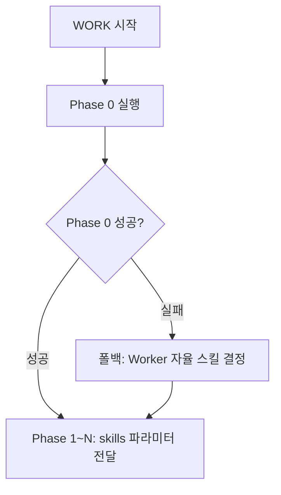

# Phase 0: 준비 단계 상세 가이드

> **Phase 0 스킵 조건:** no-plan 모드에서만 스킵 (단일 태스크이므로 스킬 매핑 불필요)

> **Phase 배너**: 오케스트레이터는 Phase 0 Worker 호출 직전에 `Workflow <registryKey> WORK-PHASE 0 "phase0" sequential` 배너를 출력합니다. Worker 자체는 Phase 배너를 호출하지 않습니다.

Phase 0은 모든 full 모드 워크플로우에서 **필수로** 실행합니다. no-plan 모드에서만 스킵합니다.

**Phase 0 실행 판단:**



**Phase 0 실행:**

```
Task(subagent_type="worker", prompt="command: <command>, workId: <workId>, taskId: phase0, planPath: <planPath>, mode: phase0")
```

Phase 0은 **1개 worker 에이전트가 순차적으로** 실행합니다.

**Phase 0의 2가지 기능:**

1. **work 작업 디렉터리 생성**: `<workDir>/work/` 디렉터리를 명시적으로 생성합니다.

2. **스킬 매핑**: 계획서(plan.md)의 태스크 목록과 사용 가능한 스킬 목록(`.claude/skills/` 하위)을 비교하여 각 태스크에 적합한 스킬을 매핑합니다.
   - 명령어별 기본 스킬 매핑 테이블을 기반으로 판단
   - 태스크 내용의 키워드를 분석하여 추가 스킬 추천
   - 계획서에 이미 스킬이 명시된 태스크는 그 값을 존중

**Phase 0 결과물:**
- `<workDir>/work/skill-map.md` 파일에 스킬 매핑 결과 저장

**skill-map.md 형식:**
```markdown
# Skill Map

| 태스크 ID | 태스크 설명 | 추천 스킬 | 판단 근거 |
|-----------|------------|----------|----------|
| W01 | [태스크 설명] | skill-a, skill-b | [근거] |
| W02 | [태스크 설명] | skill-c | [근거] |
```

**Phase 0 완료 후:** 오케스트레이터는 skill-map.md를 참고하여 후속 Phase 1~N의 worker 호출 시 skills 파라미터를 전달합니다.

**Phase 0 실패 시 폴백:**

Phase 0이 실행되었으나 실패를 반환한 경우, C 방식(개별 자율 결정)으로 자동 폴백합니다:
1. Phase 0 실패를 로그에 기록
2. skill-map.md 없이 Phase 1로 진행
3. 각 Worker가 skills 파라미터 없이 자율 결정으로 작업 수행

이 폴백 메커니즘은 Phase 0의 SPOF(단일 장애점) 위험을 완화합니다.
